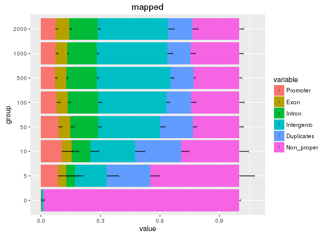

# Annotation plots with smallCAGEqc
Charles Plessy  
`r Sys.Date()`  


R commands
==========

The main command to produce annotation plots in _smallCAGEqc_ is called
`plotAnnot`.  It takes a table containing the sample metadata, a _scope_,
a title and optionally a factor to group similar plots together.

Here, we will use some of the example data that is distributed in _smallCAGEqc_.
The commands below load the R package and load the example data in a data frame
called `libs`.


```r
library(smallCAGEqc)
libs <- read.table(system.file("extdata/libs-with-all-metadata.tsv", package="smallCAGEqc"))
```

The _scopes_ determine what data is plotted and how it is normalised.

Data categories
---------------

The following categories describe the total remaining pairs after each step of
the processing.


 - **total**: The total number of pairs before tag extraction.  In some cases this
   number is not available per sample, for example when demultiplexing and tag
   extraction are performed at the same stage.

 - **extracted**: The number of pairs where the linkers and unique molecular
   identifier (if present) were succesfully extracted. 
   
 - **cleaned**: The number of pairs remaining after filtering out spike, rRNA,
   low-complexity, primer artefact and other unwanted sequences.
   
 - **mapped**: The number of pairs with at least one successful alignment.
 
 - **properpairs**: The number or pair remaining after filtering out the
   non-proper alignments.
 
 - **counts**: The number of unique molecules counted after alignment.
 
The following categories describe the number of pairs removed at each step of
the processing.


 - **unextracted**: The total number of pairs where a tag could not be extracted.
 
 - **spikes**, **rRNA**: The number of pairs removed because they matched
   spikes or rRNA reference sequences, respectively.
  
 - **tagdust**: The number of pairs removed because of low-complexity or
   similarity to primer artefacts.}
   
 - **unmapped**: The number of non-mapped pairs.
 
 - **non-proper**: The number of non-properly mapped pairs.
 
 - **duplicates**: The number of pairs that do not add a molecule count.
 

Different types of scopes
=========================

Step-by-step extraction
-----------------------

Shows how many pairs are removed by the extraction, cleaning, mapping
(proper pairs) and transcript counting steps described above.


```r
plotAnnot(libs, "steps", "steps")
```

<!-- -->

QC report
---------

Pairs are categorised as tag dust, rDNA, spikes, unmapped, non-proper,
duplicates and counts, and normalised by the total number of extracted pairs.
Non-extracted pairs are ignored.


```r
plotAnnot(libs, "qc", "qc")
```

<!-- -->

Annotation of the transcript or tag counts
------------------------------------------

The unique molecule counts are grouped in annotation categories
("promoter", "exon", "intron" and "intergenic").


```r
plotAnnot(libs[libs$counts > 0,], "counts", "counts")
```

<!-- -->

Annotation of the mapped reads
------------------------------

"promoter","exon","intron","intergenic", "duplicates"


```r
plotAnnot(libs, "mapped", "mapped")
```

<!-- -->

QC including annotations
------------------------

Pairs are categorised by extraction step and genome annotation.


```r
plotAnnot(libs, "all", "all")
```

<!-- -->

Annotation, normalised by mapped reads
--------------------------------------

Same as `all` except that normalisation is relative to the number of mapped reads


```r
plotAnnot(libs, "annotation", "annotation")
```

<!-- -->


Contents of the `libs` table
============================


```r
libs
```

```
##     samplename sampleid  total extracted cleaned tagdust  rdna spikes
## A01        A01        1  57836     44740   33456   11244    40      0
## A02        A02        2  56608     42798   31358   11404    36      0
## A03        A03        3  79068     60769   49450   11283    36      0
## A04        A04        4  51895     37394   26998   10356    40      0
## A05        A05        5  62074     45786   34516   11239    31      0
## A06        A06        6  44003     29504   21978    7471    55      0
## A07        A07        7  60988     42773   28707   14026    40      0
## A08        A08        8  32950     23815   17276    6508    31      0
## A09        A09        9  28039     21889   15656    6163    70      0
## A10        A10       10  33938     24986   18511    6455    20      0
## A11        A11       11  31996     24512   16077    8352    83      0
## A12        A12       12  31146     24500   16029    8435    36      0
## B01        B01       13 113516     79890   47354    6246 26290      0
## B02        B02       14  72654     50406   31768    4061 14577      0
## B03        B03       15 106809     62736   50864    6573  5299      0
## B04        B04       16  80569     47843   34153    6099  7591      0
## B05        B05       17 107056     65211   48808    6118 10285      0
## B06        B06       18  79748     43397   30860    4525  8012      0
## B07        B07       19 110920     65635   51751    4582  9302      0
## B08        B08       20  66320     45432   28835    6448 10149      0
## B09        B09       21  95686     62955   40331    4706 17918      0
## B10        B10       22  55199     33872   18625    5643  9604      0
## B11        B11       23  48259     30849   21371    4268  5210      0
## B12        B12       24  72900     46406   26727    4635 15044      0
## C01        C01       25 149338     89401   49290    7319 32792      0
## C02        C02       26 138463     88758   63852    2770 22136      0
## C03        C03       27 129733     84172   49076    4081 31015      0
## C04        C04       28 110834     65837   49627    3515 12695      0
## C05        C05       29 143846     78132   53696    4636 19800      0
## C06        C06       30 109061     68825   38230    5636 24959      0
## C07        C07       31 119133     75078   44183    3683 27212      0
## C08        C08       32  78937     50912   33410    3141 14361      0
## C09        C09       33  92263     57695   35157    4207 18331      0
## C10        C10       34 104621     64239   47782    3627 12830      0
## C11        C11       35  77071     43272   31482    2827  8963      0
## C12        C12       36  75814     44190   34379    2762  7049      0
## D01        D01       37 211918    108057   93175     687 14195      0
## D02        D02       38 126215     72882   61995     446 10441      0
## D03        D03       39 141855     72767   59564     392 12811      0
## D04        D04       40 176145     89332   79117     443  9772      0
## D05        D05       41 175940     86247   74584     587 11076      0
## D06        D06       42 121366     62256   53868     519  7868      1
## D07        D07       43 121058     61880   51964     503  9413      0
## D08        D08       44  72706     36161   29710     397  6054      0
## D09        D09       45  97847     42801   33270     371  9160      0
## D10        D10       46 100807     54161   46082     400  7679      0
## D11        D11       47 108622     53295   47374     470  5450      1
## D12        D12       48 128301     62093   54183     339  7571      0
## E01        E01       49 198156    114073  101593     262 12215      3
## E02        E02       50 110978     56915   50023     194  6698      0
## E03        E03       51 115523     59100   52904     219  5977      0
## E04        E04       52  64343     32652   29219      63  3370      0
## E05        E05       53 133978     64977   58020     281  6676      0
## E06        E06       54 110519     54552   48413     208  5930      1
## E07        E07       55 102993     52575   46403     215  5957      0
## E08        E08       56  88876     42892   39408     200  3282      2
## E09        E09       57  84478     36919   33088     145  3685      1
## E10        E10       58  98540     47225   41223     425  5577      0
## E11        E11       59  94995     48522   42903     193  5425      1
## E12        E12       60  59296     34992   31704     131  3157      0
## F01        F01       61 133894     69445   64738     179  4528      0
## F02        F02       62 104592     52786   49382     143  3260      1
## F03        F03       63 105865     56012   53310     194  2508      0
## F04        F04       64 151032     70854   67432     160  3262      0
## F05        F05       65 133736     62248   58816     203  3229      0
## F06        F06       66 112267     49548   47160      88  2298      2
## F07        F07       67 120527     56568   52913     192  3463      0
## F08        F08       68  81028     36749   34530     155  2064      0
## F09        F09       69  82247     37776   35593     208  1975      0
## F10        F10       70 116168     53753   50827     170  2755      1
## F11        F11       71  85752     41126   39325     168  1633      0
## F12        F12       72  96754     40894   39065     159  1670      0
## G01        G01       73 157245     77357   73610     185  3560      2
## G02        G02       74 140353     64494   61409     162  2923      0
## G03        G03       75 106273     48053   45657     214  2182      0
## G04        G04       76 161767     70158   67226     196  2736      0
## G05        G05       77 111602     48539   46504     151  1883      1
## G06        G06       78 145265     61302   58751     155  2396      0
## G07        G07       79 170602     68849   66149     272  2428      0
## G08        G08       80  85777     36517   34632     149  1736      0
## G09        G09       81  87382     34965   33038     171  1755      1
## G10        G10       82  80439     29017   28083     183   751      0
## G11        G11       83  76145     32785   31503     128  1153      1
## G12        G12       84  91108     35631   33763     169  1699      0
## H01        H01       85 167121     75412   72015     252  3145      0
## H02        H02       86 134912     59559   57087     148  2324      0
## H03        H03       87  98710     44567   42472     241  1854      0
## H04        H04       88 144495     58339   56288     204  1847      0
## H05        H05       89 129765     43742   41949     336  1457      0
## H06        H06       90 113057     42409   39991     139  2279      0
## H07        H07       91 176644     66278   63319     240  2719      0
## H08        H08       92  98958     34662   33525     196   941      0
## H09        H09       93  83042     29701   28537     171   993      0
## H10        H10       94  66452     20773   19790      81   902      0
## H11        H11       95  89280     27906   26841     166   899      0
## H12        H12       96  83539     28756   27666     148   942      0
##     mapped properpairs counts group group_alpha row col Concentration
## A01  16191         161    128     0       0.000   1   A         0.162
## A02  15558         166    123     0       0.000   2   A         0.176
## A03  21330         211    159     0       0.000   3   A         0.162
## A04  11657         226    164     0       0.000   4   A         0.137
## A05  18286         291    215     0       0.000   5   A         0.152
## A06  10913         149    111     0       0.000   6   A         0.167
## A07  10873           0      0     0       0.000   7   A         0.177
## A08   8403         126    105     0       0.000   8   A         0.184
## A09   6973         135     98     0       0.000   9   A         0.208
## A10   9937         120    109     0       0.000  10   A         0.153
## A11   7830         208    126     0       0.000  11   A         0.161
## A12   7225         129    102     0       0.000  12   A         0.155
## B01  37640       22667  14343     5       0.005   1   B         0.156
## B02  24362       13744   7537     5       0.005   2   B         0.197
## B03  41386       17864  12282     5       0.005   3   B         0.203
## B04  26392       17496  11951     5       0.005   4   B         0.160
## B05  42219       23383  14708     5       0.005   5   B         0.154
## B06  26235       16390   9672     5       0.005   6   B         0.186
## B07  45950       27813  14672     5       0.005   7   B         0.243
## B08  23143       13753   8318     5       0.005   8   B         0.065
## B09  35094       20483  11170     5       0.005   9   B         0.230
## B10  13506        6561   3603     5       0.005  10   B         0.145
## B11  15098        7019   4573     5       0.005  11   B         0.145
## B12  21986        9790   5586     5       0.005  12   B         0.190
## C01  41268       27344  15537    10       0.010   1   C         0.247
## C02  59641       43036  29995    10       0.010   2   C         0.348
## C03  43278       34189  22366    10       0.010   3   C         0.235
## C04  45103       33171  19651    10       0.010   4   C         0.217
## C05  49398       30795  20012    10       0.010   5   C         0.267
## C06  34091       24496  18016    10       0.010   6   C         0.235
## C07  40045       29773  21171    10       0.010   7   C         0.155
## C08  29481       21380  14386    10       0.010   8   C         0.090
## C09  31130       22610  15230    10       0.010   9   C         0.276
## C10  42111       30183  20526    10       0.010  10   C         0.320
## C11  27613       18027  13697    10       0.010  11   C         0.223
## C12  30804       20590  13729    10       0.010  12   C         0.297
## D01  89865       65730  52248    50       0.050   1   D         0.530
## D02  60842       45193  34407    50       0.050   2   D         0.542
## D03  58729       47380  36083    50       0.050   3   D         0.620
## D04  77923       60089  44735    50       0.050   4   D         0.527
## D05  72447       56669  43199    50       0.050   5   D         0.497
## D06  52333       39002  31387    50       0.050   6   D         0.568
## D07  50824       39326  31103    50       0.050   7   D         0.771
## D08  28976       22389  18234    50       0.050   8   D         0.690
## D09  32704       24638  19555    50       0.050   9   D         0.616
## D10  44784       34443  27639    50       0.050  10   D         0.478
## D11  46716       35769  27793    50       0.050  11   D         0.604
## D12  53167       41331  33085    50       0.050  12   D         0.636
## E01  99997       79165  62741   100       0.100   1   E         0.472
## E02  48990       37058  30889   100       0.100   2   E         0.616
## E03  51701       41228  33789   100       0.100   3   E         0.633
## E04  28879       20711  17324   100       0.100   4   E         0.577
## E05  57053       44186  36254   100       0.100   5   E         0.523
## E06  47367       34363  28622   100       0.100   6   E         0.669
## E07  45657       34766  28742   100       0.100   7   E         0.802
## E08  38534       28422  23454   100       0.100   8   E         0.724
## E09  32387       23970  20526   100       0.100   9   E         0.606
## E10  39997       30301  27506   100       0.100  10   E         0.451
## E11  42451       32153  26738   100       0.100  11   E         0.614
## E12  31410       24025  20323   100       0.100  12   E         0.668
## F01  63961       49002  41263   500       0.500   1   F         0.974
## F02  48692       38696  32393   500       0.500   2   F         0.718
## F03  52663       40504  34118   500       0.500   3   F         0.723
## F04  66550       51626  43342   500       0.500   4   F         0.719
## F05  57743       43906  37310   500       0.500   5   F         0.720
## F06  46529       36544  31401   500       0.500   6   F         0.903
## F07  52396       40338  33918   500       0.500   7   F         0.887
## F08  34156       25786  22086   500       0.500   8   F         1.016
## F09  35174       26843  22878   500       0.500   9   F         1.009
## F10  50011       38554  32330   500       0.500  10   F         0.754
## F11  38810       29784  25397   500       0.500  11   F         0.871
## F12  38666       29332  25302   500       0.500  12   F         0.677
## G01  72874       56189  46184  1000       1.000   1   G         1.053
## G02  60664       45441  37084  1000       1.000   2   G         0.929
## G03  45000       33837  28132  1000       1.000   3   G         0.908
## G04  66289       51171  42594  1000       1.000   4   G         0.883
## G05  45715       35589  29503  1000       1.000   5   G         0.942
## G06  58119       43708  36940  1000       1.000   6   G         1.056
## G07  64834       47451  39214  1000       1.000   7   G         1.178
## G08  34114       24866  21295  1000       1.000   8   G         1.067
## G09  32645       23779  20003  1000       1.000   9   G         1.108
## G10  27695       20601  19151  1000       1.000  10   G         0.960
## G11  31184       24414  21011  1000       1.000  11   G         1.150
## G12  33260       25400  21678  1000       1.000  12   G         0.872
## H01  71031       53719  42839  2000       2.000   1   H         1.678
## H02  56441       43344  34846  2000       2.000   2   H         1.278
## H03  41591       31472  25730  2000       2.000   3   H         1.588
## H04  55498       43738  35853  2000       2.000   4   H         1.439
## H05  41274       31941  29084  2000       2.000   5   H         1.559
## H06  39554       31613  26223  2000       2.000   6   H         1.834
## H07  62372       45835  36225  2000       2.000   7   H         1.901
## H08  33016       25111  21283  2000       2.000   8   H         1.695
## H09  28126       20602  17633  2000       2.000   9   H         1.236
## H10  19449       14311  12514  2000       2.000  10   H         1.529
## H11  26455       20579  17642  2000       2.000  11   H         1.421
## H12  27106       21307  18492  2000       2.000  12   H         1.525
##              Run   l1   r100l1 exon intron other promoter unknown genes
## A01 1772-087-069   40 35.00393    2     42     0       10      74    12
## A02 1772-087-069   39 34.53797    0     38     0        9      76    10
## A03 1772-087-069   49 38.12546    7     36     0       12     104    16
## A04 1772-087-069   50 37.21116    0     46     0        7     111    15
## A05 1772-087-069   53 35.38931    6     49     0       31     129    20
## A06 1772-087-069   38 35.65686    1     35     0        9      66    11
## A07 1772-087-069    0  0.00000    0      0     0        0       0     0
## A08 1772-087-069   37 35.94311    2     24     0       19      60    13
## A09 1772-087-069   30 30.00000    2     16     0        3      77     9
## A10 1772-087-069   35 33.54695    2     21     0       12      74     8
## A11 1772-087-069   62 53.58818   17     21     0       16      72    22
## A12 1772-087-069   37 36.62609    1     30     0        2      69    10
## B01 1772-087-069  106 14.64366 6204    335     0     1938    5866    38
## B02 1772-087-069  290 19.19440 1926    419     0     4040    1152    80
## B03 1772-087-069  142 17.20786  179    261     0     6122    5720    30
## B04 1772-087-069  154 18.44604 1834   2255     0     4921    2941    51
## B05 1772-087-069  134 16.75237  132    786     0     2388   11402    31
## B06 1772-087-069  159 19.54335  365   2462     0     1466    5379    43
## B07 1772-087-069  211 18.26080 3529    636     0     2961    7546    53
## B08 1772-087-069  152 19.59785   17   2366     0     2154    3781    39
## B09 1772-087-069  344 28.23019   14   1154     0     1840    8162    40
## B10 1772-087-069  124 21.74362   66   1213     0      785    1539    37
## B11 1772-087-069  116 13.26322 1344     64     0      389    2776    24
## B12 1772-087-069  162 20.94065   64   1214     0     1563    2745    42
## C01 1772-087-069  242 25.48931  160   3797     0     2821    8759    61
## C02 1772-087-069  402 32.73442  971   7466     0    10701   10857    84
## C03 1772-087-069  305 27.92000 4783   6179     0     3044    8360    76
## C04 1772-087-069  370 31.87616 1798   1200     0     3225   13428    81
## C05 1772-087-069  440 31.36962 1199   5118     0     4552    9143   116
## C06 1772-087-069  212 22.82430 1817    579     0     7720    7900    59
## C07 1772-087-069  360 38.94175 2403   1797     1     5564   11406    93
## C08 1772-087-069  280 32.94986 2075   4031     3     3589    4688    70
## C09 1772-087-069  276 23.03263  293   3485     0     2464    8988    81
## C10 1772-087-069  417 45.88426 3744   5515     0     3529    7738   138
## C11 1772-087-069  241 27.15281 2437   1929     0     2658    6673    59
## C12 1772-087-069  293 28.72867 1261   3338     0     1090    8040    80
## D01 1772-087-069 1448 73.93816 6003   9940     0     9260   27045   348
## D02 1772-087-069 1405 77.98528 3542   8960     0     5350   16555   340
## D03 1772-087-069 1379 74.17269 2642   9327     0     4804   19310   300
## D04 1772-087-069 1581 76.47927 4336   9913     0     7374   23112   366
## D05 1772-087-069 1869 79.00155 2869  11857     0     4877   23596   394
## D06 1772-087-069 1715 78.34378 1972   7444     1     4598   17372   399
## D07 1772-087-069 1198 72.20326 3211   6987     0     5560   15345   296
## D08 1772-087-069 1002 72.18696 2923   4015     0     3575    7721   260
## D09 1772-087-069 1005 72.88108 2479   4706     0     2412    9958   270
## D10 1772-087-069 1507 78.98770 2867   6133     0     3407   15232   393
## D11 1772-087-069 1379 77.20211 2263   6242     1     3720   15567   337
## D12 1772-087-069 1392 77.06525 3876   8104     0     3738   17367   339
## E01 1772-087-069 2265 85.16074 5622  15233     0     7352   34534   556
## E02 1772-087-069 1900 85.41793 2566   7968     0     4010   16345   458
## E03 1772-087-069 1842 84.26035 3321   8877     0     4517   17073   466
## E04 1772-087-069 1658 85.84360 1608   4630     0     1513    9573   449
## E05 1772-087-069 2378 87.09019 3630   9858     0     3804   18962   559
## E06 1772-087-069 2138 87.99389 1837   5630    35     3990   17130   541
## E07 1772-087-069 1924 86.41941 2197   7446     0     3399   15700   497
## E08 1772-087-069 1765 86.77928 2110   5009     0     2402   13933   472
## E09 1772-087-069 1723 87.35975 2255   4181     2     2895   11193   483
## E10 1772-087-069 1793 85.70211 3102   6129     0     4647   13628   501
## E11 1772-087-069 1925 86.98539 2419   6827     1     3573   13918   507
## E12 1772-087-069 1814 87.78132 1325   4795     5     2504   11694   481
## F01 1772-087-069 3635 92.62051 4607   9108     4     3963   23581   917
## F02 1772-087-069 3358 92.82644 2575   8424     0     2852   18542   817
## F03 1772-087-069 3563 93.57936 3014   7998     0     3717   19389   854
## F04 1772-087-069 4136 93.90090 3620   9944     0     4850   24928   982
## F05 1772-087-069 3837 93.98819 3379   8444     1     4408   21078   930
## F06 1772-087-069 3741 93.91198 2160   7017    62     3832   18330   888
## F07 1772-087-069 3819 94.19979 3466   8135     0     3976   18341   951
## F08 1772-087-069 3155 94.12737 1746   5710     0     3014   11616   842
## F09 1772-087-069 3691 94.74871 2216   5101    23     2702   12836   967
## F10 1772-087-069 3615 92.98439 2627   7025     1     2741   19936   816
## F11 1772-087-069 3532 93.98666 1875   6082     0     2950   14490   932
## F12 1772-087-069 3669 94.64871 2066   6055     0     2218   14963   962
## G01 1772-087-069 4439 94.46853 4186  10762    39     6198   24999  1038
## G02 1772-087-069 4053 92.75496 3855   8373     0     3806   21050   949
## G03 1772-087-069 3752 93.66966 2697   7029     2     2832   15572   903
## G04 1772-087-069 3900 92.09875 4283   9929     0     4208   24174   850
## G05 1772-087-069 3356 92.67858 2740   6714     0     2979   17070   775
## G06 1772-087-069 3873 92.82608 3718   9021     0     4142   20059   914
## G07 1772-087-069 5138 94.78783 3631   9264     2     5200   21117  1242
## G08 1772-087-069 3977 94.43834 2051   5135     0     3144   10965  1080
## G09 1772-087-069 3806 95.08377 1742   4376     0     2667   11218  1024
## G10 1772-087-069 2642 92.13822 1432   4437     1     1757   11524   636
## G11 1772-087-069 3136 93.63214 1756   4911     0     2883   11461   800
## G12 1772-087-069 3411 94.58613 1795   4978     3     2374   12528   869
## H01 1772-087-069 4296 92.15265 4700   9467     7     4900   23765   980
## H02 1772-087-069 3697 93.16116 3503   8810   119     4394   18020   863
## H03 1772-087-069 3260 92.42869 2731   5836     0     2818   14345   802
## H04 1772-087-069 3112 90.11942 3835   7867     1     4015   20135   684
## H05 1772-087-069 2847 88.82836 3141   5493     1     3349   17100   677
## H06 1772-087-069 2671 85.46402 3499   5371     1     2258   15094   601
## H07 1772-087-069 4125 89.92747 4114   7256     0     3854   21001   934
## H08 1772-087-069 3086 92.93838 2827   5158    24     2465   10809   844
## H09 1772-087-069 3581 93.04251 2007   3820     0     2580    9226   986
## H10 1772-087-069 2565 93.39395 1287   3116     0     1515    6596   700
## H11 1772-087-069 2491 90.60411 1498   3957     0     2038   10149   595
## H12 1772-087-069 2738 91.97103 2105   4229     0     1751   10407   637
```

R session info
==============


```r
sessionInfo()
```

```
## R version 3.3.1 (2016-06-21)
## Platform: x86_64-pc-linux-gnu (64-bit)
## Running under: Debian GNU/Linux 8 (jessie)
## 
## locale:
##  [1] LC_CTYPE=en_GB.utf8        LC_NUMERIC=C              
##  [3] LC_TIME=en_GB.UTF-8        LC_COLLATE=en_GB.utf8     
##  [5] LC_MONETARY=en_GB.UTF-8    LC_MESSAGES=en_GB.utf8    
##  [7] LC_PAPER=en_GB.UTF-8       LC_NAME=C                 
##  [9] LC_ADDRESS=C               LC_TELEPHONE=C            
## [11] LC_MEASUREMENT=en_GB.UTF-8 LC_IDENTIFICATION=C       
## 
## attached base packages:
## [1] stats     graphics  grDevices utils     datasets  methods   base     
## 
## other attached packages:
## [1] smallCAGEqc_0.12.2.99999 magrittr_1.5            
## 
## loaded via a namespace (and not attached):
##  [1] Rcpp_0.12.2          knitr_1.13           munsell_0.4.2       
##  [4] lattice_0.20-29      colorspace_1.2-6     stringr_1.0.0       
##  [7] plyr_1.8.3           tools_3.3.1          grid_3.3.1          
## [10] gtable_0.1.2         vegan_2.0-10         lambda.r_1.1.7      
## [13] futile.logger_1.4.1  htmltools_0.2.6      gtools_3.5.0        
## [16] yaml_2.1.13          digest_0.6.8         permute_0.8-3       
## [19] ggplot2_2.1.0        formatR_1.4          futile.options_1.0.0
## [22] VennDiagram_1.6.16   evaluate_0.8         rmarkdown_0.9.6     
## [25] labeling_0.3         gdata_2.17.0         stringi_1.0-1       
## [28] scales_0.4.0         reshape_0.8.5
```
